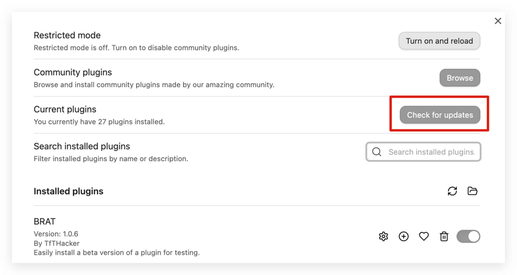
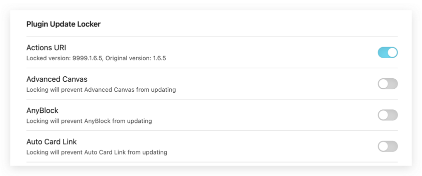

# Plugin Update Locker

English | [中文](./README.zh-cn.md)

It can prevent specified plugins in Obsidian from updating, ensuring that these plugins run stably on a specific version and avoiding compatibility issues or feature changes caused by updates.

Obsidian does not directly provide an interface to block updates. Therefore, by modifying the specified plugin's version in the `manifest.json`, we can bypass the software's update detection mechanism and achieve the goal of preventing plugin updates.

As shown in the image above, when clicking the "Check for updates" button during the plugin update process, the system checks for all updatable plugins and proceeds to update them.

Currently, the plugin modifies the specified plugin's `manifest.json` file to change its version, effectively bypassing the plugin update detection.

## Usage

Plugin Configuration Page

The plugin configuration page displays all the plugins and allows users to configure whether to lock their updates.

### Lock Plugin Updates
- 1、For example: For the "Actions URI" plugin, click the button to select Lock Update. The plugin version will change from `1.6.5` to `9999.1.6.5`.
- 2、When clicking the "Check for updates" button again, the plugin will not be detected or updated as long as its version is less than `9999.1.6.5`.

### Unlock Plugin Updates
- 1、For example: For the "Actions URI" plugin, click the button to select Cancel Lock Update. The plugin version will change from `9999.1.6.5` back to `1.6.5`.
- 2、When clicking the "Check for updates" button again, if a new version is available, it will be detected, and the plugin can be updated.

## Reason for Plugin Development and Its Purpose

Currently, I want to ask questions and receive replies from AI models like ChatGPT and save them as notes for easier record-keeping and review later.

I ultimately chose to use the [obsidian-smart-connections](https://github.com/brianpetro/obsidian-smart-connections) plugin. However, after upgrading the plugin from version `2.2.85` to `2.3.42`, I found that there were significant changes between these two versions.

The "Custom API (OpenAI format)" configuration that I frequently used was removed, which caused issues with customizing interfaces like ChatGPT's API.

This led me to the idea of adding a plugin update lock feature to prevent sudden changes caused by updates, allowing me to wait until future versions stabilize before removing the lock.

