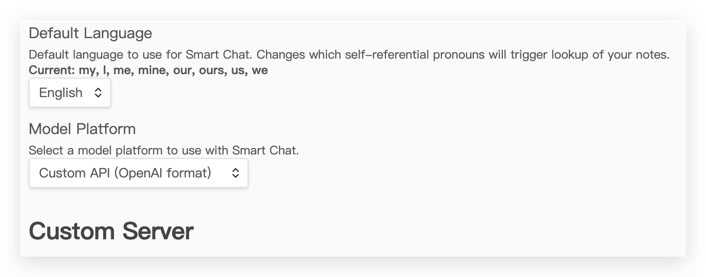

# Plugin Update Locker

English | [中文](./README.zh-cn.md)

It can prevent specified plugins in Obsidian from updating, ensuring that these plugins run stably on a specific version and avoiding compatibility issues or feature changes caused by updates.

## Usage

## Reason for Plugin Development and Its Purpose

Currently, I want to ask questions and receive replies from AI models like ChatGPT and save them as notes for easier record-keeping and review later.

I ultimately chose to use the [obsidian-smart-connections](https://github.com/brianpetro/obsidian-smart-connections) plugin. However, after upgrading the plugin from version `2.2.85` to `2.3.42`, I found that there were significant changes between these two versions.

The "Custom API (OpenAI format)" configuration that I frequently used was removed, which caused issues with customizing interfaces like ChatGPT's API.

This led me to the idea of adding a plugin update lock feature to prevent sudden changes caused by updates, allowing me to wait until future versions stabilize before removing the lock.

