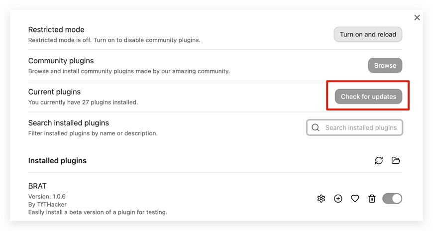
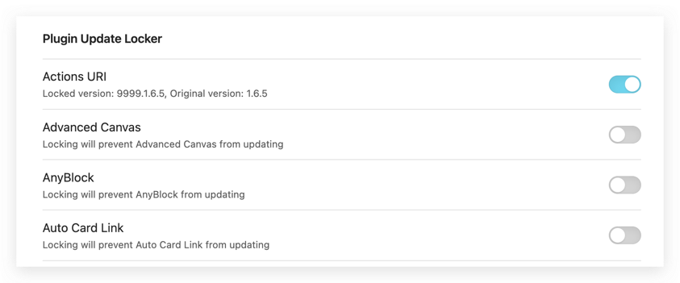
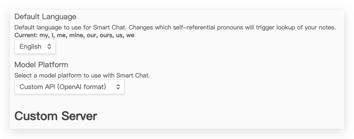

# Plugin Update Locker

English | [中文](./README.zh-cn.md)

Plugin Update Locker helps you freeze selected Obsidian community plugins on a known-good version. It works by rewriting a target plugin's `manifest.json` version to a very large value (for example `9999.1.6.5`) so Obsidian treats it as already up to date.

## Features

- **Version locking**: Prevent selected plugins from being updated by prefixing their version with `9999.`.
- **Batch operations**: Lock or unlock all currently visible plugins after search / filtering.
- **Conflict detection**: Detect mismatches between lock records and physical plugin files.
- **Snapshot and restore**: Create a snapshot before locking and restore backed-up plugin assets later.
- **Release preview**: Click a plugin name to try fetching GitHub release notes and compare versions when repository information can be resolved.
- **Compatibility warning**: Warn when a plugin's `minAppVersion` is newer than your current Obsidian version.
- **Config sync**: Export lock settings to JSON files inside your vault and import JSON config files from the same vault.
- **Bilingual UI**: English and Chinese interface support.

## Usage

### Plugin list management
The settings page shows installed community plugins and lets you manage their lock state.

- **Lock**: Toggle a plugin on. Its version changes from `x.y.z` to `9999.x.y.z`.
- **Unlock**: Toggle it off to restore the original version.
- **Batch lock / unlock**: Use the top action buttons on the currently visible list.
- **Manual scan**: Re-scan for conflicts after external file changes.

### Snapshot recovery
Before a plugin is locked, Plugin Update Locker can save a snapshot of:
- `main.js`
- `styles.css`
- `manifest.json`

If a later update breaks the plugin, you can restore the saved snapshot from the settings page.

### Release notes preview
When the changelog module is enabled, clicking a plugin name attempts to fetch GitHub release data and opens a modal preview when the plugin repository can be identified.

### Config export / import
Use the sync module to:
- export current lock settings to `Plugin Update Locker/locker-config-YYYY-MM-DD.json` inside your current vault;
- import any JSON config file that already exists inside the current vault.

## External access and data changes
- The locking feature directly rewrites other community plugins' `manifest.json` files inside your vault configuration directory.
- The snapshot feature stores backup copies of `main.js`, `styles.css`, and `manifest.json` for target plugins.
- The changelog feature sends requests to the GitHub Releases API when you click a plugin name or when version preview data is fetched.

## Network note
The changelog feature requests data from the GitHub Releases API only when that module is enabled and used.

## Why this exists
Many Obsidian plugins ship breaking changes between versions. This plugin is meant for users who prefer to stay on a stable, known-good version until they are ready to migrate.

