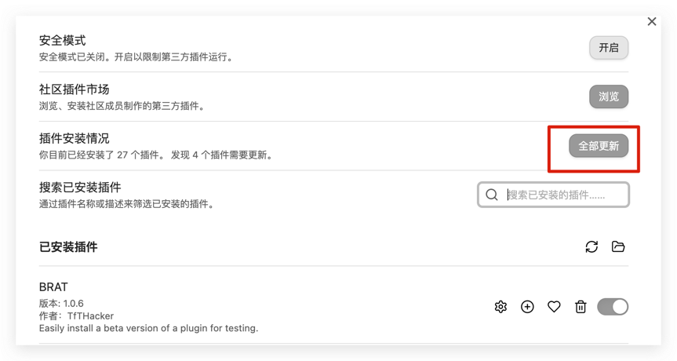

# 插件更新锁 (Plugin Update Locker)

[English](./README.md) | 中文

Plugin Update Locker 用来冻结指定的 Obsidian 社区插件版本。它会把目标插件 `manifest.json` 中的版本号改写成极大值（例如 `9999.1.6.5`），从而让 Obsidian 认为该插件已经是最新版本。

## 功能特性

- **版本锁定**：给目标插件版本号加上 `9999.` 前缀，阻止其继续被更新。
- **批量操作**：支持对当前搜索 / 过滤后仍可见的插件批量锁定或解锁。
- **冲突检测**：自动识别“设置记录”和“物理插件文件”之间的不一致。
- **快照与还原**：锁定前自动备份插件关键文件，后续可一键还原。
- **更新日志预览**：当能够识别插件仓库信息时，点击插件名可尝试读取 GitHub Release Notes 并对比版本差异。
- **兼容性提示**：根据插件 `minAppVersion` 检查与当前 Obsidian 版本是否兼容。
- **配置同步**：支持把锁定配置导出为当前 Vault 内的 JSON 文件，并从当前 Vault 中导入 JSON 配置。
- **双语界面**：支持中文与英文界面。

## 使用方式

### 插件列表管理
设置页会列出当前已安装的社区插件，并允许你直接管理其锁定状态。

- **锁定**：打开插件开关后，版本号会从 `x.y.z` 变成 `9999.x.y.z`。
- **解锁**：关闭开关即可恢复原始版本号。
- **批量锁定 / 解锁**：使用顶部操作按钮，对当前可见插件统一处理。
- **手动扫描**：在外部文件被改动后，可手动重新扫描冲突。

### 快照恢复
锁定前，插件可自动备份以下文件：
- `main.js`
- `styles.css`
- `manifest.json`

如果后续更新覆盖了插件文件，可以在设置页中直接恢复已保存的快照。

### 更新日志预览
启用 changelog 模块后，当能够识别插件仓库信息时，点击插件名会尝试拉取 GitHub Release，并弹出预览窗口。

### 配置导出 / 导入
通过 sync 模块可以：
- 把当前锁定配置导出为当前 Vault 内的 `Plugin Update Locker/locker-config-YYYY-MM-DD.json`；
- 从当前 Vault 中已有的 JSON 配置文件导入设置。

## 外部访问与数据变更说明
- 锁定功能会直接改写你 Vault 配置目录下其他社区插件的 `manifest.json` 文件。
- 快照功能会为目标插件保存 `main.js`、`styles.css`、`manifest.json` 的备份副本。
- 更新日志功能会在你点击插件名或触发版本预览时请求 GitHub Releases API。

## 网络说明
更新日志功能仅在启用并实际使用时才会请求 GitHub Releases API。

## 开发初衷
很多 Obsidian 插件在升级过程中会带来破坏性变更。这个插件适合想把工作流稳定在“已验证版本”上的用户，等准备好以后再手动迁移。

