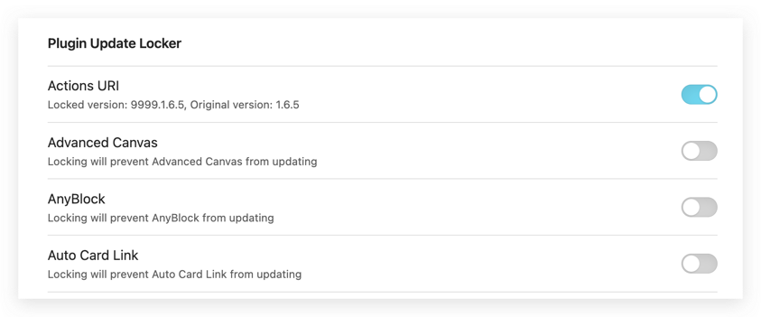
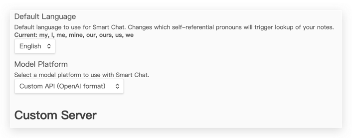

# 插件更新锁

[English](./README.md) | 中文

可以防止 Obsidian 中的指定插件更新，从而确保这些插件在特定版本下稳定运行，避免因更新引起的兼容性问题或功能变动。

Obsidian软件并没有直接提供阻拦更新的接口,所以通过更新指定插件version的方式达到避开软件更新检测,从而达到避免插件更新的目的.

如上图所示,进行插件更新时点击"全部更新"的按扭,检测可更新新版本的插件并全部更新.

当前插件修改指定插件`manifest.json`变更其中的插件版本,避开插件更新检测.

## 使用方式

插件配置页面

插件配置页面显示所有的插件,可以进行配置是否锁定.
 
### 锁定插件
- 1、例如:"Actions URI"插件,点击按扭选择锁定更新,该插件版本从`1.6.5`变更为`9999.1.6.5`.
- 2、再次选择"全部更新"按扭,该插件的版本只要小于`9999.1.6.5`版本,就不会被检测到,插件也不会更新.

### 解除锁定
- 1、例如:"Actions URI"插件,点击按扭选择取消锁定更新,该插件版本从`9999.1.6.5`变更为`1.6.5`.
- 2、再次选择"全部更新"按扭,该插件存在新版本就会被检测到,插件可以被更新.

## 插件开发起因与该插件的作用

当前我希望询问ChatGPT等AI的问题和回复能够保存整理成笔记,方便后续记录笔记、复盘.

最终选择使用插件[obsidian-smart-connections](https://github.com/brianpetro/obsidian-smart-connections).

但是将该插件的版本从`2.2.85`升级到`2.3.42`后,发现这两个版本有很大的变更.

我经常使用的"Custom API(OpenAI format)"配置给移除了,导致我使用的类似ChatGPT的API接口无法自定义配置.

所以才想到希望添加一个插件更新锁定的功能,避免出现这种突然的版本变更影响使用,等后续版本稳定后再移除锁定.

